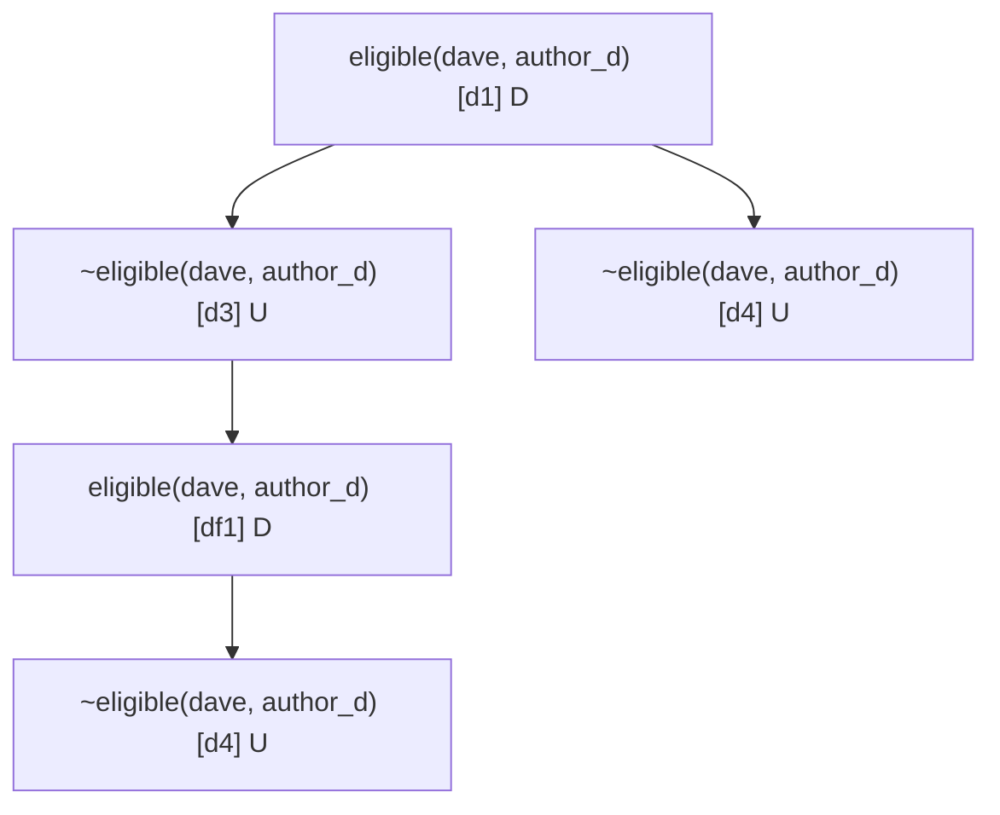

# Gunray

*(named for Donald Nute, by way of Nute Gunray)*

A defeasible logic engine in pure Python. Tell it rules that contradict
each other and it works out which conclusions survive — and, if you ask,
exactly why. Zero runtime dependencies, MIT, Python 3.11+.

```python
from gunray import DefeasibleTheory, GunrayEvaluator, ClosurePolicy, MarkingPolicy, Rule

theory = DefeasibleTheory(
    facts={"bird": {("tweety",), ("opus",)}, "penguin": {("opus",)}},
    strict_rules=[Rule(id="s1", head="bird(X)", body=["penguin(X)"])],
    defeasible_rules=[
        Rule(id="r1", head="flies(X)",  body=["bird(X)"]),
        Rule(id="r2", head="~flies(X)", body=["penguin(X)"]),
    ],
)

model = GunrayEvaluator().evaluate(theory, marking_policy=MarkingPolicy.BLOCKING)
# model.sections["defeasibly"] contains flies(tweety) and ~flies(opus).
```

`~flies(X) :- penguin(X)` is a *defeasible* rule, not a strict one. It's
weaker than anything classical logic would let you write — but strong
enough to win against `flies(X) :- bird(X)` on the penguin case without
contradicting the strict fact that penguins are still birds.

## `UNDECIDED` is a first-class answer

Sometimes the evidence genuinely does not resolve. Nixon was a Quaker
*and* a Republican; one defeasible rule says Quakers are pacifists,
another says Republicans aren't. Neither argument out-specifies the
other — so Gunray returns `Answer.UNDECIDED` rather than inventing a
winner.

```python
from gunray import (
    Answer, DefeasibleTheory, GeneralizedSpecificity, Rule, answer,
)
from gunray.types import GroundAtom

theory = DefeasibleTheory(
    facts={"republican": {("nixon",)}, "quaker": {("nixon",)}},
    defeasible_rules=[
        Rule(id="r1", head="~pacifist(X)", body=["republican(X)"]),
        Rule(id="r2", head="pacifist(X)",  body=["quaker(X)"]),
    ],
)

pacifist_nixon = GroundAtom(predicate="pacifist", arguments=("nixon",))
criterion      = GeneralizedSpecificity(theory)

assert answer(theory, pacifist_nixon, criterion) is Answer.UNDECIDED
```

`Answer` has four values: `YES` (the literal is warranted),
`NO` (its complement is warranted), `UNDECIDED` (arguments exist on
both sides and neither wins), `UNKNOWN` (the predicate is not in the
language of the theory). This is García & Simari 2004 Def 5.3.

## Install

```bash
pip install git+https://github.com/ctoth/gunray.git
# or
uv add git+https://github.com/ctoth/gunray.git
```

For development:

```bash
git clone https://github.com/ctoth/gunray.git
cd gunray
uv sync --extra dev
```

## Three evaluators, one dispatcher

`GunrayEvaluator.evaluate` dispatches on the input type.

- **`DefeasibleTheory`** → the DeLP pipeline: arguments, dialectical
  trees, Procedure 5.1 marking, four-valued answers. The main event.
- **`Program`** → stratified Datalog with Apt-Blair-Walker safety and a
  choice of negation semantics (see below).
- **Propositional defaults** → KLM rational / lexicographic / relevant
  closure via `gunray.closure.ClosureEvaluator`.

```python
from gunray import GunrayEvaluator, Program

model = GunrayEvaluator().evaluate(Program(
    facts={"edge": {("a", "b"), ("b", "c")}},
    rules=[
        "path(X, Y) :- edge(X, Y).",
        "path(X, Z) :- edge(X, Y), path(Y, Z).",
    ],
))
# model.facts["path"] == {("a", "b"), ("b", "c"), ("a", "c")}
```

`DefeasibleEvaluator`, `SemiNaiveEvaluator`, and `ClosureEvaluator` are
exported directly if you'd rather skip the dispatcher.

## Explanations — why did the engine decide that?

What was concluded is usually less interesting than why. For any
conclusion, Gunray gives you the dialectical tree, a marking, and a
prose transcript of the argument-and-defeater chain. Using the Tweety
theory from the opening example:

```python
from gunray import (
    GeneralizedSpecificity, build_arguments, build_tree,
    explain, mark, render_tree,
)
from gunray.types import GroundAtom

flies_opus = GroundAtom(predicate="flies", arguments=("opus",))
criterion  = GeneralizedSpecificity(theory)

for arg in build_arguments(theory):
    if arg.conclusion == flies_opus and arg.rules:
        tree = build_tree(arg, criterion, theory)
        print(render_tree(tree))          # Unicode tree diagram
        print(mark(tree))                 # "U" (warranted) or "D" (defeated)
        print(explain(tree, criterion))   # prose transcript
        break
```

```
flies(opus)  [r1]  (D)
└─ ~flies(opus)  [r2]  (U)
D
flies(opus) is NO.
An argument supports flies(opus) from {bird(opus)} via r1.
It is defeated by an argument for ~flies(opus) from {penguin(opus)} via r2, which is strictly more specific.
```

Trees also render to Mermaid via `render_tree_mermaid`. Here is the
peer-review conflict-of-interest case from
[`examples/reviewer_assignment.py`](examples/reviewer_assignment.py) —
a disqualification waiver (`df1`) is specific enough to lift
institutional COI (`d3`), but an explicit superiority pair keeps
advisor COI (`d4`) above the waiver:



The `[d1] D` / `[d3] U` markings are the Procedure 5.1 verdicts at each
node. The tree is how a contested conclusion becomes legible when the
answer disagrees with your intuition.

For the full `evaluate_with_trace` API — stratum-by-stratum rule-fire
logs for Datalog, `tree_for` / `marking_for` /
`arguments_for_conclusion` lookups for defeasible theories — see
[`ARCHITECTURE.md`](ARCHITECTURE.md).

## `SAFE` vs `NEMO` — negation semantics

Rules with variables in negated body literals have two competing
readings in the literature. Gunray ships both.

- `NegationSemantics.SAFE` (default) — Apt, Blair & Walker 1988
  stratified-Datalog safety. Every variable in a negated body literal
  must be bound by a positive body literal. Unsafe programs raise
  `SafetyViolationError`.
- `NegationSemantics.NEMO` — Ivliev et al. 2024 (KR 2024,
  [doi:10.24963/kr.2024/70](https://doi.org/10.24963/kr.2024/70)):
  variables in negated literals are interpreted existentially over the
  active Herbrand universe. Used by the conformance suite's Nemo
  fixtures.

Same theory, different answers. See
[`examples/safe_vs_nemo.py`](examples/safe_vs_nemo.py).

## Tests

```bash
uv run pytest tests -q
uv run pytest tests/test_conformance.py \
  --datalog-evaluator=gunray.conformance_adapter.GunrayConformanceEvaluator -q
uv run pyright
uv run ruff check
uv run ruff format --check
```

The conformance suite is
[`ctoth/datalog-conformance-suite`](https://github.com/ctoth/datalog-conformance-suite).
A handful of fixtures are explicitly out-of-contract and marked skip —
see [`ARCHITECTURE.md`](ARCHITECTURE.md#out-of-contract) for the list
and the reasons.

## More

- [`examples/`](examples/) — the full catalogue. Showcase cases, domain
  depth (clinical, GDPR, data fusion, access control), engine breadth
  (Datalog, KLM closure, SAFE vs NEMO), and Mermaid visuals.
- [`ARCHITECTURE.md`](ARCHITECTURE.md) — module layout, DeLP pipeline
  internals, preference composition, strict-only fast path, pitfalls.
- [`CITATIONS.md`](CITATIONS.md) — the paper trail.
